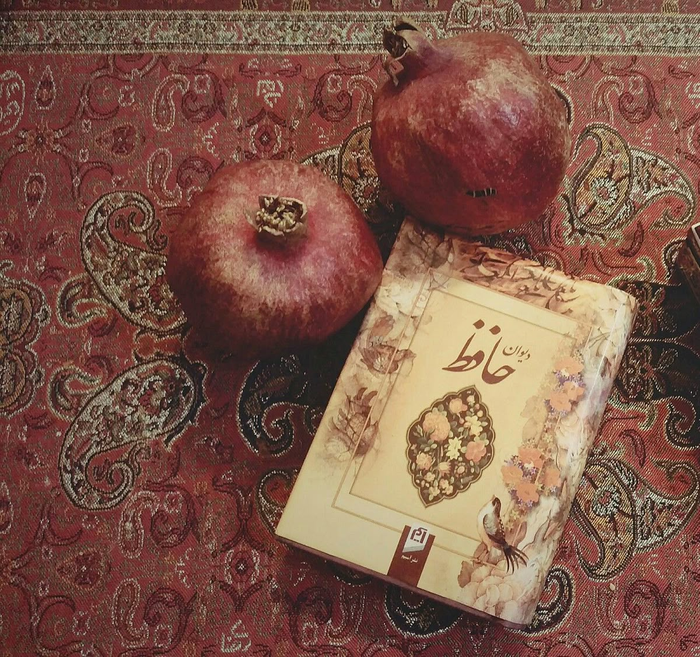
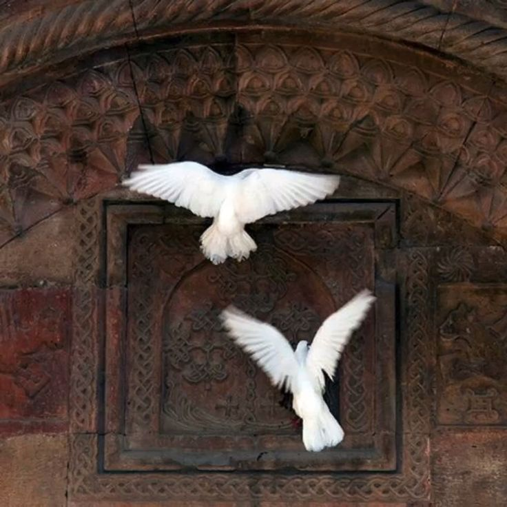

# About Hafez Fortune (Fal Hafez)

  

    
    
  

  

    Hafez is one of the most celebrated Persian poets, known for his mystical and lyrical poetry. In Persian culture, a long-standing tradition exists called “Fal Hafez”, or “Hafez fortune-telling,” where people seek guidance and inspiration by randomly opening his divan (collection of poems) and reading a poem.

  The idea is simple but profound: the poem you open at a moment of reflection is considered to hold insight, advice, or encouragement relevant to your current situation. This practice blends literature, spirituality, and personal introspection, and it remains a beloved cultural tradition in Iran and among Persian-speaking communities worldwide.

  This project recreates the experience digitally, allowing users to receive a random poem by Hafez along with its interpretation, and to explore his timeless poetry in multiple languages.
  

